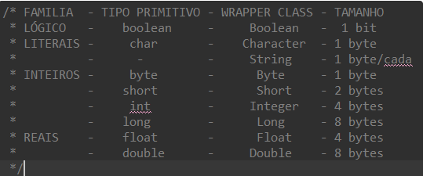

# Resumo de Java

## 1- Introdução

**Ecossistema Java**

* JVM (Java Virtual Machine)
* JDK (JavaDevelopment Kit)
* Linguagem Java
* JRE (Java Runtime Environment)

O programa criado na linguagem Java roda em cima do JRE e dentro do JRE temos o JVM. Quando compilamos um programa em Java não geramos um executável e sim um Bytecode que roda em cima da JVM.

Os arquivos .class que estão sendo criados são os arquivos Bytecode. Podemos executar esses arquivos através do terminal utilizando java e em seguida o nome do arquivo sem a extensão.

Podemos também compilar um arquivo java no terminal utilizando o javac seguido do nome do arquivo.

Código fonte (Programa.java) -> bytecode (Programa.class) -> Executável

**Convenções**

| tipo       | Convenção                                | Exemplo                  |
| ---------- | ------------------------------------------ | ------------------------ |
| package    | Prefixo único e com letras minúsculas    | edu.cmu.cs.bovik.chees   |
| Classes    | PascalCase                                 | class ImageSprit         |
| Interfaces | PascalCase                                 | interface RasterDelegate |
| métodos   | camelCase                                  | runFast()                |
| variáveis | camelCase                                  | float myWidth            |
| Constantes | Letras maiúsculas separadas por underline | MAX_WIDTH = 999          |

**Comentários em Java**

```java
// Comentário de uma linha
/*
 * Comentário de várias linhas
 */
```

## 2 - Programa Inicial

```java
public class App {
    public static void main(String[] args) throws Exception {
        System.out.println("Hello, World!");
    }
}
```

## 3 - Variáveis

Para declarar uma variável utilizamos a sintaxe:
tipo nome;

**Exemplos:**

```java
public class App {
    public static void main(String[] args){
        boolean estaAtivo = false;
        char sexo = 'M'; // Temos que usar aspas simples em variáveis do tipo char
        byte num1 = 10;
        short num2 = 128;
        int num3 = 32768;
        long num4 = 2147483647L;
        float num5 = 14.5f;
        double num6 = 554.5;
    }
}
```

Tipos possíveis:


Repare que precisamos escrever f após um número float e L após um número do tipo long.

|  Tipo  | Valores possíveis                                     |
| :-----: | ------------------------------------------------------ |
|  byte  | -128 a 127                                             |
|  short  | -32768 a 32767                                         |
|   int   | -2.147.483.648 a 2.147.483.647                         |
|  long  | -9.223.372.036.854.775.808 a 9.223.372.036.854.775.807 |
|  float  | Valores reais com 32 bits                              |
| double | Valores reais com 62 bits                              |
|  char  | Valores únicos (caracteres)                           |
| String | Textos                                                 |
| boolean | true ou false                                          |

### 3.1 - Escopo de variáveis

* Escopo de método - variáveis criadas dentro de métodos só ficam visiveis dentro dos próprios métodos.
* Uma variável declarada em um bloco de código só existe até o final desse bloco de código.
* Variáveis que são argumentos de método existem até o final do método.
* As variáveis de classe/objeto existem durante o tempo de vida do objeto. Sua visibilidade é regulado pelos modificadores de acesso
* As variáveis de classe estática existem o tempo todo em que o programa está sendo executado e sua visibilidade é determinada pelos modificadores de acesso.

### 3.2 - Imutabilidade

### 3.3 - Criando constantes

**Sintaxe:**

```java
final tipo NOME_DA_CONSTANTE;
```

**Exemplo:**

```java
public class App {
    public static void main(String[] args){
        final int ID = 1;
        System.out.println(ID);
    }
}
```

### 3.4 - Wrapper Classes

São as classes que representam os tipos primitivos do Java

| tipo primitivo | Classe Wrapper | Super classe |
| -------------- | -------------- | ------------ |
| boolean        | Boolean        | Object       |
| char           | Charactere     | Object       |
| byte           | Byte           | Number       |
| short          | Short          | Number       |
| int            | Integer        | Number       |
| long           | Long           | Number       |
| float          | Float          | Number       |
| double         | Double         | Number       |

### 3.5 - Autoboxing e Unboxing

Podemos atribuir diretamente um valor a um objeto de uma classe Wrapper sem utilizar o operador new, chamamos essa operação de Autoboxing. Da mesma forma, podemos criar variáveis de tipos primitivos a partir de wrapper classes, chamamos esse processo de auto un-boxing.

```java
public class App {
    public static void main(String[] args){
        // Auto boxing
        String nome = "MARIA";
        Boolean estaAtivo = false;
        Character sexo = 'M';
        Byte num1 = 10;
        Short num2 = 128;
        Integer num3 = 32768;
        Long num4 = 32768L;
        Float num5 = 14.5f;
        Double num6 = 544.5;

        // Auto unboxing
        boolean ativo = estaAtivo;
        char genero = sexo;
        byte num11 = num1;
        short num22 = num2;
        int num33 = num3;
        long num44 = num4;
        float num55 = num5;
        double num66 = num6;
    }
}
```

### 3.6 - Strings

| Método                           | Descrição                                                    |
| --------------------------------- | -------------------------------------------------------------- |
| charAt(indice)                    | Retorna o char que está no indice                             |
| startsWith(string)                | Retorna true se começa com a string e false caso contrário   |
| endsWith(string)                  | Retorna true se termina com a string e false caso contrário   |
| toCharArray()                     | Converte uma String em um array de char                        |
| getBytes()                        | Converte a string em uma array de bytes                        |
| isEmpty()                         | Verifica se uma string está vazia                             |
| split(regex)                      | Separa uma string em um array de strings de acordo com o regex |
| subString(indiceInicio,indiceFim) | Retorna um pedaço da string                                   |
| toLowerCase()                     | Converte para letras minúsculas                               |
| toUpperCase()                     | Converte para letras maiúsculas                               |
| trim()                            | Remove os espaços em brancos no começo e no final da string  |
| valeuOf(variavel)                 | Converte a variável para o tipo String                        |

## 4 - Saída de dados

| Método                                             | Significado                                            |
| --------------------------------------------------- | ------------------------------------------------------ |
| System.out.print()                                  | Imprime na tela e mantém o cursor na mesma linha      |
| System.out.println()                                | Imprime na tela mas pula uma linha                     |
| System.out.printf(expressão, arg1, arg2,..., argN) | Nos permite utilizar formatações ao imprimir na tela |

**Formatando e imprimindo dados com printf**

%[Modificadores][largura][.precisão][comprimento]código

| Código | Formato (tipo de dados)                |
| ------- | -------------------------------------- |
| %c      | char                                   |
| %s      | String                                 |
| %d      | Inteiro decimal com sinal (int)        |
| %i      | Inteiro decimal com sinal (int)        |
| %ld     | long                                   |
| %f      | float ou double                        |
| %e      | Notação científica com e minúsculo |
| %E      | Notação científica com E maiúsculo |
| %%      | Imprimi o próprio %                   |

**Caracteres de escape**

| Caractere de escape | Significado  |
| ------------------- | ------------ |
| \n                  | Pula linha   |
| \t                  | Tab          |
| \\"                 | Aspas duplas |
| \\\                 | \            |

**Mais códigos para formatação de dados (modificadores)**

| Modificador | Significado                                                                                  |
| ----------- | -------------------------------------------------------------------------------------------- |
| -           | Alinha o valor à esquerda                                                                   |
| +           | Coloca sinal em valores numéricos                                                           |
| 0           | Completa o campo de saída com zeros à esquerda                                             |
| ,           | Usa o separador de milhares: ponto na notação brasileira e vírgula na notação americana |
| (           | Mostra números negativos entre parênteses                                                  |

Para concatenar strings podemos utilizar o sinal de +
**Exemplo:**

```java
public class SaidaDados {
    public static void main(String[] args){
        // Imprimindo sem pular linha
        System.out.print("Olá, mundo!");

        // Imprimindo na tela e pulando linha
        System.out.println("Olá, mundo!");

        // Imprimindo de forma formatada
        float num1 = -145.7689f;
        System.out.printf("Número formatado: %0+10.2f", num1); //Número formatado: -000145,77
    }
}
```

## 5 - Entrada de dados

**Passo 1) Precisamos primeiro importar a classe Scanner**

```java
import java.util.Scanner;
```

**Passo 2) Precisamos instanciar um objeto da classe Scaneer passando como argumento o System.in**

```java
Scanner scan = new Scanner(System.in)
```

**Passo 3) Agora já podemos ler dados do teclado utilizando algum dos seguintes métodos**

| Método         | Significado                                                                     |
| --------------- | ------------------------------------------------------------------------------- |
| next()          | Utilizado para ler Strings simples, ou seja, que não possuem espaço em branco |
| nextDouble()    | Retorna um double                                                               |
| hasNextDouble() | Retorna true se o próximo dado de entrada pode ser interpretado como um double |
| nextInt()       | Retorna um número inteiro                                                      |
| hasNextInt()    | Retorna true se o próximo dado de entrada pode ser interpretado como int       |
| nextLine()      | Retorna uma cadeia de caracteres                                                |
| nextLong()      | Retorna um long                                                                 |

**Passo 4) Fechar o scan utilizando o método close()**

```java
scan.close()
```

**Exemplo:**

```java
import java.util.Scanner;

public class EntradaSaida {
    public static void main(String[] args){
        Scanner scan = new Scanner(System.in);
        String nome = "";
  
        System.out.print("informe o seu nome");
        nome = scan.nextLine();
        System.out.println("O seu nome é: "+ nome);

        scan.close();
    }
}
```

## 6 - Conversão de tipos

### 6.1 - Conversão automática

É a conversão feita automaticamente quando convertemos um tipo menor em um tipo maior.
Pense por exemplo no tipo byte e no tipo int, o tipo int engloba o tipo byte. Então nós podemos realizar a conversão desse tipo de dados de forma explícita.

**Exemplo:**

```java
public class Conversao {
    public static void main(String[] args){
        byte num1 = 10;
        int num2 = num1;
        // imprimindo o tipo do dado
        System.out.println( ((Object)num2).getClass().getSimpleName() ); //Integer
    }
}
```

### 6.2 - Conversão Manual

Quando convertemos um tipo maior para um tipo menor

**Sintaxe:**
(tipo_que_queremos) variavel;

**Exemplo:**

```java
public class Conversao {
    public static void main(String[] args){
        byte num1;
        int num2 = 10;

        num1 = (byte) num2;

        // imprimindo o tipo do dado
        System.out.println( ((Object)num1).getClass().getSimpleName() ); //Byte
    }
}
```

### 6.3 -  ClasseWrapper.valueOf(valor)

Podemos realizar conversões utilizando a Classe que queremos converter e utilizar o método valueOf

**Exemplo:**

```java
public class Conversao {
    public static void main(String[] args){
        String texto;
        int num;

        // Convertendo de inteiro para String
        texto = String.valueOf(10);

        // Convertendo de String para Integer
        num = Integer.valueOf("10");

        // imprimindo o tipo do dado
        System.out.println( ((Object)texto).getClass().getSimpleName() ); // String
        System.out.println( ((Object)num).getClass().getSimpleName() ); // Integer
    }
}
```

## 7 - Operadores

### 7.1 - Aritméticos

| Operador | Significado     |
| -------- | --------------- |
| +        | Adição        |
| -        | Subtração     |
| *        | Multiplicação |
| /        | Divisão        |
| %        | Módulo         |
| ++       | Incremento      |
| --       | Decremento      |

### 7.2 - Atribuição

| Operador | Exemplo | É igual a: |
| -------- | ------- | ----------- |
| =        | x = 5   | x = 5       |
| +=       | x += 3  | x = x + 3   |
| -=       | x -= 3  | x = x -3    |
| *=       | x *= 3  | x = x *3    |
| /=       | x /= 3  | x = x/3     |
| %=       | x % 3   | x = x % 3   |
| &=       | x &= 3  | x = x & 3   |
| \|=      | x\|= 3  | x = x\| 3  |
| ^=       | x ^= 3  | x = x ^3    |
| >>=      | x >>= 3 | x = x >> 3  |
| <<=      | x <<= 3 | x = x << 3  |

### 7.3 - Comparação

| Operador | Significado    |
| -------- | -------------- |
| ==       | Igual          |
| !=       | Diferente      |
| >        | Maior          |
| <        | Menor          |
| >=       | Maior ou igual |
| <=       | Menor ou igual |

### 7.4 - Lógicos

| Operador | Significado |
| -------- | ----------- |
| &&       | and         |
| \|\|     | or          |
| !        | not         |

## 8 - Estruturas de decisão

### 8.1 - if else

**Sintaxe:**

```java
if(condição){
    // Instruções
} else if(condição){
    // Instruções
} else {
    // Instruções
}
```

**Exemplo:**

```java
public class EstruturaDecisao {
    public static void main(String[] args){
        // if else
        int nota = 85;
        if(nota >= 60){
            System.out.println("Aprovado");
        } else if(nota < 60 && nota >= 40){
            System.out.println("Recuperação");
        } else {
            System.out.println("Reprovado");
        }
    }
}
```

### 8.2 - Operador ternário

**Sintaxe:**

```java
variavel = (condição) ? valorSeVerdadeiro :  valorSeFalso;
```

**Exemplo:**

```java
public class EstruturaDecisao {
    public static void main(String[] args){
        int num = 5;
        String resultado = "";

        // Queremos verificar se um número é par
        resultado = (num % 2 == 0) ? "É par" : "Não é par";

        System.out.println("O número "+num+" "+resultado);
    }
}
```

### 8.3 - switch

**Sintaxe:**

```java
switch(variavel) {
  case x:
    // code block
    break;
  case y:
    // code block
    break;
  default:
    // code block
}
```

**Exemplo:**

```java
public class EstruturaDecisao {
    public static void main(String[] args){
        int opcao = 5;

        switch(opcao){
            case 1:
                System.out.println("Você escolheu a opção 1");
                break;
            case 2:
                System.out.println("Você escolheu a opção 2");
                break;
            default:
                System.out.println("Você não escolheu uma opção válida");
        }
        // Resultado : Você não escolheu uma opção válida
    }
}
```

## 9 - Estruturas de repetição

### 9.1 - while

**Sintaxe:**

```java
while (condição){
    // Código
    // Incremento
}
```

**Exemplo 1:**

```java
public class EstruturaRepeticao {
    public static void main(String[] args){
        // Imprimindo um número de 1 a 5
        int contador = 1;
        while (contador <= 5) {
            System.out.println(contador);
            contador++;
        }
    }
}
```

**Exemplo 2: Utilizando o continue**

```java
public class EstruturaRepeticao {
    public static void main(String[] args){
        // Imprimindo os números ímpares de 1 a 10
        int contador = 1;
        while (contador <= 10) {
            if(contador % 2 == 0){
                contador++;
                continue;
            }
            System.out.println(contador);
            contador++;
        }
        // Resultado: 1,3,5,7,9
    }
}
```

**Exemplo 3 - Utilizando o break**

```java
public class EstruturaRepeticao {
    public static void main(String[] args){
        // Se o número for maior ou igual a 5 eu quero parar o loop
        int contador = 0;
        while (contador <= 10){
            if(contador == 5){
                break;
            }
            System.out.println(contador);
            contador++;
        }
    }
}
```

### 9.2 - do while

**Sintaxe**

O do while primeiro executa o código e depois checa a condição. É util quando queremos executar o código pelo menos uma vez independente da condição e depois checar a condição para saber se relamente devemos continuar.

```java
do {
    // Código
} while (condição)
```

**Exemplo:**

```java
public class EstruturaRepeticao {
    public static void main(String[] args){
        int contador = 10;
        do {
            System.out.println(contador); // 10
            contador++;
        } while(contador < 5);
        System.out.println(contador); // 11
    }
}

```

### 9.3 - for

**Sintaxe:**

```java
for(inicio;fim;incremento){
    // Código
}
```

**Exemplo:**

```java
public class EstruturaRepeticao {
    public static void main(String[] args){
        for(int i =0; i <=5 ; i++){
            System.out.println(i);
        }
    }
}
```

### 9.4 - for each

**Sintaxe:**

```java
for (tipo variavel : array){
    // Código
}
```

**Exemplo:**

```java
public class EstruturaRepeticao {
    public static void main(String[] args){
        String[] cars = {"Volvo", "BMW", "Ford", "Mazda"};
        for (String i : cars) {
            System.out.println(i);
        }
    }
}
```

## 10 - Vetores

Em java os vetores possuem tamanho fixo e não podem ser aumentados ou diminuidos.
Em java todos os elementos de um vetor precisam ser do mesmo tipo.

```java
public class Vetores {
    public static void main(String[] args){
        // Declarando um vetor
        int[] vetor = {1,2,3,4,5};

        // Desempacotando vetores
        int num1 = vetor[0];
        System.out.println(num1);

        // iterando sobre vetores
        for (int i = 0; i < vetor.length; i++){
            System.out.println(vetor[i]);
        }

        // Mudando valores de um vetor
        vetor[0] = 25;
        for (int num : vetor){
            System.out.println(num);
        }
    }
}
```

### 10.1 - Matrizes

**Sintaxe:**

```java
// Declarando uma matriz
tipo[][] nomeMatriz = new tipo[linha][coluna];
tipo[][] nomeMatriz = {{n1, n2, n3, ...}, {n4, n5, n6, ...}, {n7, n8, n9,...}}
```

**Exemplo:**

```java
public class Matrizes {
    public static void main(String[] args){
        int[][] matriz = new int[3][4];

        // Preenchendo a matriz
        for (int i = 0; i < 3; i++){
            for (int j = 0; j < 4; j++){
                matriz[i][j] = 1;
            }
        }
        // Imprimindo a matriz
        for (int i = 0; i < 3; i++){
            for (int j = 0; j < 4; j++){
                System.out.print(matriz[i][j] + " ");
            }
            System.out.println();
        }

        int lin = matriz.length; // [[],[],[]]
        int col = matriz[0].length; // Acessando a linha 0
        System.out.println(lin);
        System.out.println(col);

        // Criando uma matriz e inicializando
        int[][] matriz2 = {{1,2,3},{4,5,6}, {7,8,9}};
        int lin2 = matriz2.length;
        int col2 = matriz2[0].length;
        for (int i = 0; i < lin2; i++){
            for (int j = 0; j < col2; j++){
                System.out.print(matriz2[i][j] + " ");
            }
            System.out.println();
        }
    }
}
```

## 11 - Métodos (funções)

**Sintaxe:**

```java
modificador tipoDeRetorno nomeDaFunção (tipo argumento1, tipo argumento2){
    // Se tipoDeRetorno for diferente de void
    return valor;
}
```

O modificador pode ser um dos seguintes valores:
final, native, static, synchronized ou volatile.

O static permite executar funções sem instanciar uma classe.

**Exemplo:**

```java
import java.util.Scanner;

public class Funcoes {
    static Scanner scan = new Scanner(System.in);
    public static void main(String[] args){
        System.out.print("Digite a quantidade de frutas que quer: ");
        int quantidade = Integer.valueOf(scan.nextLine());
  
        String[] frutas = preencheVetor(quantidade);
  
        System.out.println("Sua lista de frutas ao contrário");
        imprimeVetor(frutas);

        scan.close();
    }
    static String[] preencheVetor(int quantidade){
        String[] frutas = new String[quantidade];
        for(int i = 0; i < quantidade; i++){
            System.out.println("Digite o nome da fruta ["+i+"]");
            frutas[i] = scan.nextLine();
        }
        return frutas;
    }
    static void imprimeVetor(String[] vetor){
        int quantidade = vetor.length;
        for(int i = quantidade -1; i >= 0; i--){
            System.out.print(vetor[i] + ", ");
        }
    }
}
```

### 11.1 - Documentação de funções

| Tag         | Significado                                                          |
| ----------- | -------------------------------------------------------------------- |
| @author     | Especifica o autor da classe ou do método                           |
| @deprecated | Identifica classes ou métodos obsoletos                             |
| @link       | Possibilata a definição de um link                                 |
| @param      | Mostra um parâmetro do método                                      |
| @return     | Mostra o que será retornado                                         |
| @see        | Ajudar a compreender melhor o que acontece                           |
| @since      | Indica desde quando uma classe ou método foi adiciona a aplicação |
| @throws     | Indica os tipos de exceções que podem ser lançadas por um método |
| @version    | Informa a versão                                                    |

```java
/**
* Descrição do método
* @author Nome do Autor
* @param nomeDoParam1 tipo - Descrição
* @param nomeDoParam2 tipo - Descrição
* @return nomeDoRetorno tipo - Descrição
*/
```

### 11.2 - Passagem de parâmetros por referência e valor

Em java, só é aceito a passagem por valor. Quando passamos uma variável como argumento de um método, é criado uma cópia desse valor e as mudanças feitas dentro do método não são refletidas na variável original. Porém quando passamos objeto, vetores e enums como argumento é feito uma cópia do endereço de memória desse objeto. Então se modificarmos um objeto dentro de um método, essa mudanças serão refletidas no objeto original

**Exemplo:**

```java
public class App {
    public static void main(String[] args){
        int num = 10;
        soma15(num); // imprime 25
        System.out.println("Fora da função e após ter utilizado a função, o valor de num é: "+num); // 10
    }
    public static void soma15(int num){
        num = num + 15;
        System.out.println("Dentro da função o atual valor de num é: "+ num);
    }
}
```

**Exemplo 2:**

Classe Pessoa

```java
public class Pessoa{
    public int idade;
    public String nome;

    Pessoa(int idade, String nome){
        this.idade = idade;
        this.nome = nome;
    }
}
```

```java
public class App {
    public static void main(String[] args){
        Pessoa p1 = new Pessoa(15, "Maria");
        System.out.println(p1); // Pessoa@762efe5d

        alteraPessoa(p1); // Imprime Pessoa@762efe5d que é o mesmo endereço da variável original
        System.out.println(p1.idade); // A idade foi alterada de 15 para 18 na variável original
    }
    public static void alteraPessoa(Pessoa pessoa){
        System.out.println(pessoa);
        pessoa.idade = 18;
    }
}
```

**Exemplo 3**

```java
public class App {
    public static void main(String[] args){
        int[] numeros = {1,2,3};
        System.out.println("Números antes da alteração");
        for (int numero : numeros){
            System.out.println(numero);
        }
        // 1 2 3

        System.out.println("Números após a modificação");
        alteraVetor(numeros);
        for (int numero : numeros){
            System.out.println(numero);
        }
        // 15 2 3
    }
    public static void alteraVetor(int[] numeros){
        numeros[0] = 15;
    }
}
```

### 11.3 - varargs

- Nos permitem passar n argumentos em uma função.
- Devem vir sempre no fim dos argumentos.

**Sintaxe:**

```java
Wrapper... nome
```

**Exemplo:**

```java
public class App {
    public static void main(String[] args){
        System.out.println(soma(1f,2f,3f,4f));
    }
    public static float soma(Float... numeros){
        float resultado = 0f;
        for (float numero : numeros){
            resultado = resultado + numero;
        }
        return resultado;
    }
  
}
```

## 12 - Programação Orientada a Objetos (POO)

-> O nome da classe java deve ser igual ao nome do arquivo
-> Uma classe java não implementa o método main

Pilares da POO:

- Encapsulamento (atributos devem ser do tipo private e só podemos modificá-los e acessá-los fora da classe utilizando métodos do tipo public)
- Herança (quando uma classe filha herda atributos e métodos de uma classe pai)
- Polimorfismo (quando uma classe filha sobreescreve, ou seja, muda o comportamento de um método pai)

**Exemplo:**

Classe Pessoa

```java
public class Pessoa {
    /*==================== Atributos ======================== */
    private String nome, email;
    private int anoNascimento;
  
    /*==================== get e set ======================== */
    public String getNome(){
        return this.nome;
    }
    public void setNome(String nome){
        this.nome = nome;
    }

    /*==================== Construtor ======================== */
    public Pessoa(){
        this.nome = "";
        this.email = "";
        this.anoNascimento = 0;
    }
    // Sobrecarga do método construtor
    public Pessoa(String nome, String email, int anoNascimento){
        this.nome = nome;
        this.email = email;
        this.anoNascimento = anoNascimento;
    }
    /*==================== Métodos =========================== */
    public void andar(){
        System.out.println(("Pessoa andando..."));
    }
    public void imprimeInformacoes(){
        System.out.println(this.nome);
        System.out.println(this.email);
        System.out.println(this.anoNascimento);
    }
}
```

Programa Java:

```java
public class Poo2 {
    public static void main(String[] args){
        Pessoa pessoa2 = new Pessoa("Maria", "maria@gmail.com",1990);
        System.out.println(pessoa2.getNome());
        pessoa2.setNome("Carlos");
        System.out.println(pessoa2.getNome());

        pessoa2.imprimeInformacoes();
        pessoa2.andar();
    }
}

```

### 12.1 - Modificadores de acesso

**Modificadores de visibilidade**

- public (Fica disponível fora da classe)
- private (Só está disponível dentro da classe)
- protected - default - (Só está disponível dentro do mesmo pacote onde foi declarado)

**Modificadores de classe**

- static
- abstract (quando queremos impedir a instanciação de objetos de uma classe, ou seja, queremos que ela sirva apsenas como base para as outras)
- final (impede de ser reescrito ou extendido)

**Modificadores de métodos**

- static (é aquele que pode ser utilizado sem instanciar um objeto)
- abstract (é aquele que serve apenas de base, cabe a classe filha realizar a implementação desse método)

Normalmente:
-> Atributos como private
-> Classes e métodos públicos

### 12.2 - Herança

Quando uma classe filha (ou sub classe) herda da outra, ela recebe todos os atributos e métodos da classe mãe (também chamada de classe pai, classe base e super classe).
Podemos acessar atributos e métodos da classe pai utilizando o super.

**Sintaxe:**

```java
public class ClasseFilha extends ClasseMae{
    // Método construtor
    public ClasseFilha(tipos argumentosClasseMae, tipos argumentosClasseFilha){
        super(argumentosClasseMae);
    }
}
```

**Exemplo:**

Classe pai

```java
public abstract class Pessoa {
    /*==================== Atributos ======================== */
    private String nome;
    private int anoNascimento;
  
    /*==================== get e set ======================== */
    public String getNome(){
        return this.nome;
    }
    public void setNome(String nome){
        this.nome = nome;
    }
    public int getIdade(){
        return this.anoNascimento;
    }
    public void setAnoNascimento(int anoNascimento){
        this.anoNascimento = anoNascimento;
    }

    /*==================== Construtor ======================== */
    public Pessoa(){
        this.nome = "";
        this.anoNascimento = 0;
    }
    // Sobrecarga do método construtor
    public Pessoa(String nome,  int anoNascimento){
        this.nome = nome;
        this.anoNascimento = anoNascimento;
    }
    /*==================== Métodos =========================== */
    public void andar(){
        System.out.println(("Pessoa andando..."));
    }
    public void imprimeInformacoes(){
        System.out.println(this.nome);
        System.out.println(this.anoNascimento);
    }
}
```

Classe filha

```java
public class Aluno extends Pessoa{
    private int matricula;

    // Métodos get e set
    public int getMatricula(){
        return this.matricula;
    }
    public void setMatricula(int matricula){
        this.matricula = matricula;
    }
    // Construtor
    public Aluno(String nome, int anoNascimento, int matricula){
        super(nome, anoNascimento);
        this.matricula = matricula;
    }
    // Polimorfismo - sobreescrita de método - (quando mudamos o comportamento de um método pai)
    public void andar(){
        System.out.println("Aluno andando...");
        System.out.println("Que é diferente do método andar da classe pai");
        super.andar();
    }
    // Sobrecarga de método
    public void andar(String tipo){
        System.out.println(tipo + " andando..");
    }
}
```

Programa principal:

```java
public class Main {
    public static void main(String[] args){
        Aluno a1 = new Aluno("João", 1994, 123);

        System.out.println(a1.getNome());
        a1.andar();
        a1.andar("Um aluno, que é uma pessoa");
    }
}
```

### 12.3 - Classes abstratas

-> São classes utilizadas como base para outras.
-> Não podemos instanciar objetos de uma classe abstrata.
-> Classes abstratas podem criar métodos abstratos.
-> Métodos abstratatos são métodos que não possuem implementação na classe pai, porém, se uma classe filha herda dessa classe pai ela é obrigada a implementar esse método.

Classe pai abstrata

```java
public abstract class Pessoa {
    /*==================== Atributos ======================== */
    private String nome;
    private int anoNascimento;
  
    /*==================== get e set ======================== */
    public String getNome(){
        return this.nome;
    }
    public void setNome(String nome){
        this.nome = nome;
    }
    public int getIdade(){
        return this.anoNascimento;
    }
    public void setAnoNascimento(int anoNascimento){
        this.anoNascimento = anoNascimento;
    }

    /*==================== Construtor ======================== */
    public Pessoa(){
        this.nome = "";
        this.anoNascimento = 0;
    }
    // Sobrecarga do método construtor
    public Pessoa(String nome,  int anoNascimento){
        this.nome = nome;
        this.anoNascimento = anoNascimento;
    }
    /*==================== Métodos =========================== */
    public void andar(){
        System.out.println(("Pessoa andando..."));
    }
    public void imprimeInformacoes(){
        System.out.println(this.nome);
        System.out.println(this.anoNascimento);
    }
    /*==================== Métodos abstratos =========================== */
    public abstract void mensagem(String msg);
}
```

Classe filha que precisa implementar o método abstrato que criamos na classe pai

```java
public class Aluno extends Pessoa{
    private int matricula;

    // Métodos get e set
    public int getMatricula(){
        return this.matricula;
    }
    public void setMatricula(int matricula){
        this.matricula = matricula;
    }
    // Construtor
    public Aluno(String nome, int anoNascimento, int matricula){
        super(nome, anoNascimento);
        this.matricula = matricula;
    }
    // Polimorfismo - sobreescrita de método - (quando mudamos o comportamento de um método pai)
    public void andar(){
        System.out.println("Aluno andando...");
        System.out.println("Que é diferente do método andar da classe pai");
        super.andar();
    }
    // Sobrecarga de método
    public void andar(String tipo){
        System.out.println(tipo + " andando..");
    }
    // Implementando o método abstrato
    public void mensagem(String msg){
        System.out.println(msg);
    }
}
```

Arquivo main

```java
public class Main {
    public static void main(String[] args){
        Aluno a1 = new Aluno("João", 1994, 123);

        System.out.println(a1.getNome());
        a1.andar();
        a1.andar("Um aluno, que é uma pessoa");
        a1.mensagem("Esse é um exemplo de método abstrato");
    }
}
```

### 12.4 - Atributos e métodos estáticos

-> O modificador static nos permite acessar atributos e métodos sem instânciar objetos daquela classe.

Atributos estáticos são atributos que "vivem nas classes". Portanto, ao criar instâncias de uma classe, essas instâncias irão compartilhar o valor desse atributo.

-> Acessamos atributos estáticos através do NomeDaClasse.nomeDoAtributo assim como acessamos métodos estáticos através de NomeDaClasse.nomeDoMétodo().
-> Podemos acessar atributos estáticos sem instanciar uma classe.
Atributos estáticos podem ser utilizados, por exemplo, para criar um identificador a cada objeto criado.

Classe Conta

```java
public class Conta {
    // atributo
    private String nome;
    private int numeroConta;

    // atributos estáticos
    public static int contador = 1;

    // get e set
    public int getNumeroConta(){
        return this.numeroConta;
    }

    // Método construtor
    public Conta(String nome){
        this.nome = nome;
        this.numeroConta = contador;
        Conta.contador++;
    }

    // Método estático
    public static void proximaConta(){
        System.out.println("A próxima conta terá como valor: " + Conta.contador);
    }
}
```

Programa Java

```java
public class App {
    public static void main(String[] args){
        Conta c1 = new Conta("Maria");
        Conta c2 = new Conta("Carlos");
        Conta c3 = new Conta("Julia");

        System.out.println(c1.getNumeroConta()); // 1
        System.out.println(c2.getNumeroConta()); // 2
        System.out.println(c3.getNumeroConta()); // 3

        System.out.println(Conta.contador); // 4
        Conta.proximaConta(); // A próxima conta terá como valor: 4
    }
}
```

A cada vez que criamos a conta, passamos o valor do Conta.contador para o número da conta e em seguida incrementamos esse valor. Então a próxima conta que for criada já estará com o valor anterior + 1. Esse foi só um exemplo didático, o ideal seria utilizar uma base de dados.

## 13 - package (Pacotes)

São pastas, em Java chamamos as pastas que criamos no nosso projeto de packages (pacotes).
Nós utilizamos pacotes para organizar melhor o nosso código.
A comvenção é sempre criar pastas com letras minúsculas.

Imagine que queremos criar uma pasta chamada poo dentro da pasta src e dentro dessa pasta poo queremos criar uma classe chamada Carro.

Ao criar esse arquivo precisamos adicionar na primeira linha a instrução package nomedapasta.
Então para o nosso exemplo o código ficaria assim:

```java
package poo;

public class Carro{
    // Atributos
    private String placa;

    // get e set
    public String getPlaca(){
        return this.placa;
    }

    // construtor
    public Carro(){
        this.placa = "xxx";
    }
}
```

Acessamos pastas em java utilizando o ponto. Então se dentro da pasta POO criarmos mais uma pasta chamada heranca e dentro de heranca criarmos a classe Moto, o código ficaria assim:

```java
package poo.heranca;

public class Moto {
  
}
```

Para importar classes podemos utilizar o import

Então se tivermos um programa java chamado Main na nossa pasta src e quisermos importar a classe Moto nesse programa podemos fazer da seguinte forma:

```java
import poo.heranca.Moto;
public class Main {
    public static void main(String[] args){
        Moto moto = new Moto();
    }
}
```

Os caminhos são escritos a partir da pasta src.

Para importar todas as classes de uma pasta podemos utilizar o * em vez de escrever o nome da classe.

## 14 - interfaces

São conhecidas como "contratos" e são utilizadas em conjunto com as classes.

```java
public interface INomeDaInterface{
    // métodos

    // métodos default

    // métodos static
}
```

É comum que interfaces sejam iniciadas pela letra i maiúsucula.

As interfaces são parecidas com as classes, mas interfaces podem ter somente assinaturas de métodos, atributos (não aconselhável) e métodos padrão. Utilizamos as interfaces como contratos que as classes devem seguir.

-> Uma classe precisa implementar todos os métodos de uma interface (com exceção dos métodos default), respeitando os argumentos desses métodos, mas não precisa declarar os atributos.
-> Uma interface não pode ter um método construtor. Por isso, não podemos criar instâncias de interfaces.
-> Uma classe pode implementar mais de uma interface

**Sintaxe:**

```java
public class NomeDaClasse implements Interface1, Interface2{

}
```

Dicas:

- Evite inserir variáveis em interfaces pois as classes não deveriam ficar restritas a ter a mesma variável.
- Todas as variáveis em uma interface são públicas mesmo se você não inserir o modificador public.
- Uma interface não pode especificar a implementação de um método (há uma exceção para esse caso que são os métodos padrões do Java 8). Se um método padrão não for implementado, o compilador utilizará a implementação do método default.
- Existe um problema quando implementamos duas interfaces que possuem métodos padrão com mesmo nome e assinatura. Podemos acessar o método que queremos chamando a Interface.super.nomeDoMétodo()
- Também podemos adicionar métodos estáticos a interfaces, se um método estático for chamado, quem será referenciado será a interface e não a classe que a implementou.
- Uma interface pode herdar outra através do extends

Nesse site podemos encontrar tudo sobre interfaces:
https://www.freecodecamp.org/portuguese/news/interfaces-em-java-explicadas-com-exemplos/

**Exemplo:**

Interface

```java
public interface IVeiculo {
    // Métodos
    public void ligar();
    public void desligar();
    // Métodos default
    default void buzinar(){
        System.out.println("Veículo buzinando");
    }
    // Métodos static
    public static void darSeta(){
        System.out.println("Veículo dando a seta");
    }
} 
```

Classe que implementa a interface

```java
public class Carro implements IVeiculo {
    // Atributos
    private String placa;

    // get e set
    public String getPlaca(){
        return this.placa;
    }
    public void setPlaca(String placa){
        this.placa = placa;
    }

    // Construtor
    public Carro(String placa){
        this.placa = placa;
    }

    // Métodos
    public void ligarLimpador(){
        System.out.println("Ligando o limpador");
    }

    // implementando os métodos da interface
    public void ligar(){
        System.out.println("Carro ligado");
    }
    public void desligar(){
        System.out.println("Carro desligado");
    }
}
```

Programa Java

```java
public class Main {
    public static void main(String[] args){
        Carro tesla = new Carro("abc-1234");

        // Executando o método implementado pela classe Carro
        tesla.ligar();

        // Executando o método default que não foi implementado pela classe Carro
        tesla.buzinar();

        // Executando o método estático criado na interface
        IVeiculo.darSeta();
    }
}
```

## 15 - enum

Utilizamos enums quando queremos criar associações constantes de dados.
Imagine a seguinte situação, possuimos um formulário web onde a pessoa pode escolher o genêro.
Queremos mostrar para o usuário as opções "Masculino" e "Feminino". Então o usuário pode preencher o formulário e enviar os seus dados para cadastro.
Porém, em vez de salvar "Masculino" e "Feminino" no nosso banco de dados, nós queremos salvar apenas "M" e "F". Essa é uma situação perfeita para utilizar o Enum. Ou seja, Queremos que "Masculino" esteja associado ao valor "M" e "Feminino" ao valor "F".

- Enums extends a classe java.lang.Enum
- Podem ser comparados usando ==
- Não podem ser instanciados com o new
- Podem implementar interfaces
- Podem ser declarados separadamente ou dentro de classe
- Opcionalmente, a declaração da classe pode incluir variáveis de instância, construtor, métodos de instância, de classe, etc.

**Criando um enum**

```java
public enum Genero {
    MASCULINO('M'), FEMININO('F');

    char sexo;

    Genero(char sexo){
        this.sexo = sexo;
    }

    public char getValor(){
        return this.sexo;
    }
}
```

Programa principal

```java
public class App {
    public static void main(String[] args){
        Genero genero = Genero.MASCULINO;

        // Imprimindo o nome
        System.out.println(genero.name()); // MASCULINO

        // Imprimindo o valor com o método que criamos
        System.out.println(genero.getValor()); // M

        // Vendo todos os valores de um enum
        for (Genero gen : Genero.values()){
            System.out.println(gen + " - " + gen.getValor() + " - Ordem: " + gen.ordinal());
        }
        /*
            MASCULINO - M - Ordem: 0
            FEMININO - F - Ordem: 1
         */
    }
}
```

**Exemplo 2: Dia da Semana**

```java
public enum DiaDaSemana {
    DOMINGO(1), SEGUNDA(2), TERCA(3), QUARTA(4), QUINTA(5), SEXTA(6), SABADO(7);

    int dia;

    DiaDaSemana(int dia){
        this.dia = dia;
    }

    public int getValor(){
        return this.dia;
    }
}

```

## 16 - try catch

**Sintaxe:**

```java
try{
    // Código a ser tentado
} catch(tipo erro){
    // Código caso aconteça um erro do tipo
} finally{
    // sempre será executado
}
```

**Exemplo:**

```java
public class App {
    public static void main(String[] args){
        int numeros[] = new int[5];

        // Preenchendo um vetor
        for (int i=0; i < numeros.length; i++){
            numeros[i] = i;
        }

        // Imprimindo um vetor
        try{
            for (int i=0; i <= numeros.length; i++){
                System.out.println(numeros[i]);
            }
        }catch(Exception erro){
            System.out.println("Você está tentando acessar uma posição que não existe");;
            System.out.println(erro);
        }finally{
            System.out.println("Esse bloco é sempre executado");
        };

        System.out.println("Código segue mesmo com o erro...");
    }
}
```

Em Java existem dois grupos de exceções

- Checked Exception

-> Exception
-> IOException
-> SQLException

- Unchecked Exceptions

-> RunTimeException
-> NullPointerException
-> ArrayOutOfBoundsException

Podemos adicionar o throws Exception a assinatura de métodos . Isso indicará que o nosso código poderá lançar a uma Exceção e, portanto, precisa ser executado dentro de um try catch.

**Exemplo:**

```java
public class App {
    public static void main(String[] args){
        int num1 = 5;
        int num2 = 0;
        int resultado = divisao(num1,num2);
        System.out.println(resultado);
    }
    public static int divisao(int num1, int num2) throws Exception{
        return num1/num2;
    }
}
```

Se tentarmos executar o código acima teremos um erro mesmo se trocarmos num2 para 5 por exemplo.
Para conseguirmos executar a função nesse caso, precisamos fazer isso dentro de um try catch como mostra o código abaixo:

```java
public class App {
    public static void main(String[] args){
        int num1 = 5;
        int num2 = 0;
        int resultado;
        try{
            resultado = divisao(num1, num2);
            System.out.println(resultado);
        }catch(Exception erro){
            System.out.println(erro);
        }
    }
    public static int divisao(int num1, int num2) throws Exception{
        return num1/num2;
    }
}
```

Podemos ainda gerar Exceções de propósito em nosso código

**Sintaxe:**

```java
throw new TipoDaExceção();
```

```java
public class App {
    public static void main(String[] args){
        int num1 = 5;
        int num2 = 0;
        int resultado;

        try {
            resultado = divisao(num1, num2);
            System.out.println(resultado);
        } catch (Exception e) {
            System.out.println("e: "+ e.toString());
            System.out.println("e.getMessage() = "+ e.getMessage().toString());
        }

        System.out.println("Código seguiu mesmo com o erro");
    }
    public static int divisao(int num1, int num2) throws Exception{
        if(num2 == 0){
            throw new ArithmeticException("Divisão por zero");
        }
        return num1/num2;
    }
}

```

## 17 - Bibliotecas padrões do Java

### 17.1 - Math

```java
public class App {
    public static void main(String[] args){

        float num1 = 4.55f;

        System.out.println(Math.E); // Constante de Euller
        System.out.println(Math.PI); // Valor de pi

        System.out.println(Math.sin(45));

        System.out.println(Math.round(num1)); // Arredonda de acordo com as casas decimais
        System.out.println(Math.floor(num1)); // Arredonda para baixo
        System.out.println(Math.ceil(num1)); // Arredonda para cima

        System.out.println(Math.pow(2, 3));
        System.out.println(Math.sqrt(9));
    }
}
```

### 17.2  - Importações estáticas

Imagine a seguinte situação: Estamos criando um programa e constantemente precisamos utilizar o método pow da Classe Math.  Precisaríamos então escrever Math.pow toda vez que quisessemos utilizar esse método. Em vez disso, podemos fazer uma importação estática e utilizá-lo sem escrever a classe Math.

**Sintaxe:**

```java
import static nomeDoPackage.NomeDaClasse.nomeDoMetodo;
// para importar todos os métodos e constantes
import static nomeDoPackage.NomeDaClasse.*;
```

**Exemplo 1:**

```java
import static java.lang.Math.pow;

public class App {
    public static void main(String[] args){
        System.out.println(pow(2,3));
        System.out.println(pow(3, 3));
    }
}
```

**Exemplo 2:**

```java
import static java.lang.Math.*;

public class App {
    public static void main(String[] args){
        System.out.println(pow(2,3));
        System.out.println(pow(3, 3));
        System.out.println(sqrt(9));
        System.out.println(PI);
    }
}
```

## 18 - Arquivos

Criação e preenchimento de arquivos

```java
public class App {
    static String mensagem = "Escrevendo em um arquivo";
    public static void main(String[] args){
        try {
            // Criando um arquivo chamado saida.txt
            PrintStream escrever = new PrintStream("saida.txt");
            // Escrevendo no arquivo
            escrever.println(mensagem);
            // fechando
            escrever.close();
        } catch (Exception e) {
            System.out.println("Não foi possível criar o arquivo");
        }
        System.out.println("Finalização do programa!");
  
    }
}
```

Leitura de arquivos

```java
import java.io.FileInputStream;
import java.io.FileNotFoundException;
import java.util.Scanner;

public class App {
    public static void main(String[] args){
        try {
            Scanner scan = new Scanner(new FileInputStream("entrada.txt"));

            while(scan.hasNextLine()){
                String linha = scan.nextLine();
                System.out.println(linha);
            }
            scan.close();
        } catch (FileNotFoundException e) {
            System.out.println("Arquivo não encontrado");
        }
        System.out.println("Finalização do programa!");
    }
}
```

Adicionando conteúdo a arquivos existentes

Ver classe File na w3schools

## 19 - Anotações

Permitem embutir informações complementares no código fonte e são precesidades de um arroba @.

- Informações para o compilador
- Runtime (tempo de execução)
- Compile ou Deploy-time (tempo de compilação ou deploy web)
